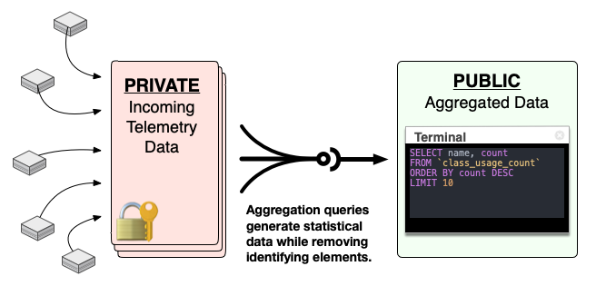

# dropsonde-aggregation

This repository contains a set of aggregation queries run weekly to build public
datasets from private telemetry metrics reported by the
[Dropsonde telemetry client](https://github.com/puppetlabs/dropsonde) without
revealing private or fingerprintable information about individual sites.

#### Run status


## Data Flow

The flow of data through the system sounds complex, but is actually fairly
straightforward. Dropsonde clients installed on Puppet masters all over the
world periodically report data back to our metrics database. Access to this
database is protected and only a small number of trusted employees and tools
have access.

Instead, the queries in this repository are run periodically via a GitHub Action
to generate aggregated statistical information and the output is stored as tables
in the public BigQuery database. See below on accessing and using that data yourself.




## Accessing Public Data

You’ll need a [Google Cloud account](https://cloud.google.com/) and then you can
access the [dataset](https://console.cloud.google.com/bigquery?p=dataops-puppet-public-data&d=aggregated)
with your browser via the BigQuery Console. Then you can run any queries you’d like.

For example, this will get you the ten most used classes in the dataset:

``` sql
SELECT name, count
FROM `dataops-puppet-public-data.aggregated.class_usage_count`
ORDER BY count DESC
LIMIT 10
```

Currently with our extremely limited dataset from beta testing, that result is:

``` json
[
  { "name": "Resource_api::Agent", "count": "272" },
  { "name": "Account",             "count": "272" },
  { "name": "Ssl::Params",         "count": "272" },
  { "name": "Classification",      "count": "272" },
  { "name": "Os_patching",         "count": "269" },
  { "name": "Ntp",                 "count": "265" },
  { "name": "Ntp::Install",        "count": "265" },
  { "name": "Ntp::Config",         "count": "265" },
  { "name": "Ntp::Service",        "count": "265" },
  { "name": "Zsh::Params",         "count": "265" }
]
```


## Writing Aggregation Queries

We would love to see community contributions to this aggregation process. We
cannot possibly predict all the fascinating ways in which you would like to
access these metrics, nor can we predict what tooling you'll want to build. We
must rely on you to help us generate the data that will benefit you the most.

It's relatively straightforward to write queries in the [BigQuery flavor of SQL](https://cloud.google.com/bigquery/docs/query-overview),
with one little wrinkle. If you can't _see_ the metrics dataset, how can one
possibly develop useful queries using that data? It's a fair question to ask.

Every so often we generate a random dataset.  It's all completely made-up data,
but it follows the actual telemetry schema exactly. And while made-up, the data
is completely representative of what the actual data looks like.

This means that you can load that [dataset](https://console.cloud.google.com/bigquery?p=dataops-puppet-public-data&d=community&t=community_metrics&page=table)
up in the BigQuery Console and develop any query to generate any metric you'd
like to see. The output of that metric will of course be meaningless during
development, but once it's modified to query the proper dataset and committed to
this repository, that metric will appear in the [public aggregation dataset](https://console.cloud.google.com/bigquery?p=dataops-puppet-public-data&d=aggregated).

> ***📍Important note:***<br />
> Any query that reveals private information will be rejected and authors who
> repeatedly commit this offense in a malicious seeming manner will be prohibited
> from contributing in the future.

